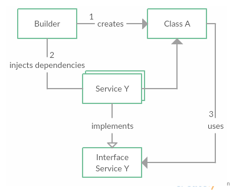

# Dependency Injection And Inversion Of Control

> Inversion of Control, or IoC, is an abstract principle describing an aspect of some software architecture designs in which the flow of control of a system is inverted in comparison to procedural programming.

To understand the explanation above, it is important to address what is procedural programming.

In procedural programming, a chunk of code that uses, or consumes, another chunk of code is in control of the process. This chunk of code knows exactly what piece of code, what method in what class, it uses.


The image above illustrates the procedural programming well. Class A, the consumer, needs the consumed classes (Services Y and Z), to run. Therefore, Class A instantiates both Y and Z classes before using those services.

The approach presented above induces a tight coupling and high dependency of Class A in relation to Classes Y and Z.
 
## Problems

* **Thight Coupling. ** When a group of classes is highly dependent on one another.
* **Break of the Single Responsibility principle.** Class A assumes too many responsibilities.
* **Break of the Principle of Least Knowledge.** Class A knows too much about Classes Y and Z.
* **Lack of abstraction.** Class A uses concrete Classes Y and Z.
* **Low testability.** The high dependency between these classes decreases testability. It becomes hard to test Class A in isolation from Class Y or Z.

The procedural approach induces some unwanted constraints:

* If it becomes necessary to replace or modify Class A's dependencies (Y and Z), a change in the source code of A is mandatory.
* Class A is difficult to test in isolation. It depends on Y and Z success as well.
* The concrete implementations of the 
* All classes contain repetitive code for creating, locating, and managing their dependencies.

A clear example in a practical problem would be:

Imagine a developer is implementing Class A, and it accesses a database, represented by Class DB. For testing purposes, the developer is not interested in setting up a database in the testing environment. The smart developer implements a mock database instead, called Class MockDB.

The problem arises when the high dependency of Class A on Class DB becomes clear. To test Class A with a mock database, the developer must change the source code of A to instantiate Class MockDB every time this person tests Class A.

This clearly becomes impractical over time and complexity.

## Solution

The most common solutions presented are Dependency Injection and Service Locator. The former seems more interesting, therefore the latter won't be explained in details.

The Dependency Injection pattern dictates that whenever a class has a dependency, it should be passed (or injected) as a parameter into it. It is a matter of not instantiating the dependencies explicitly. Just declare the dependencies and let whoever is using this class to pass the dependency.

On the example above, the database object dependency would be passed inside Class A as a parameter. Therefore, Class A becomes blind towards the implementation of the database class. Whether it is a mock database or a real database is not important, as long as Class A is able to access its methods and attributes.

But how is Class A able to use an object if it is blind towards the object's class? The answer is simple: interfaces. As far as the real database class and the mock database class implements the same interface, Class A will be able to access its methods and attributes.

The image bellow illustrates it quite well:



1. **Creation.** Whoever is using Class A, in this case the builder, instantiates Class A.
2. **Dependency Injection.** The builder also chooses between a set of possible implementations of the desired service and injects it in Class A.
3. **Usage.** Class A is blind towards the implementation of Service Y, but it uses the Interface of the desired service. Therefore, it knows which methods and attributes Service Y has, being able to make use of the service.

## Consequence

* **Decoupled classes from dependencies.** Dependencies can be updated or replaced with minimal or no changes to the classes' source code.
* **Concrete implementation of dependencies not known at compile time.**
* **Increased testability.** Classes can be tested in isolation.
* **Less responsibility to classes.** Classes don't manage their own dependencies and their lifetimes.

## Examples

### Example 1: The User Manager using Dependency Injection

Let's modify the UserManager implemented on the last chapter to use Dependency Injection

#### The Bad Way


public class UserManager
{
    private Repository<User> _userRepository;

    public UserManager()
    {
        // Instantiation of Repository class
        // This is where the high dependency and tight coupling resides
        this._userRepository = new Repository<User>();
    }

    public void CreateUser(string name, int age)
    {
        // some business logic
        if (age < 18)
        {
            throw new UserTooYoungException();
        }

        // User object (Model) is created using passed arguments
        User user = new User { Name = name, Age = age };

        this._userRepository.Create(user);
    }
}

public class Repository<T> : IRepository<T> where T : EntityBase
{
    private readonly ApplicationDbContext _dbContext;

    public Repository()
    {
        // More dependency and tight coupling
        this._dbContext = new ApplicationDbContext();
    }

    // ...
}


If, for instance, it is intended to use a mock database for testing purposes, a change in the code of Repository class would be required, since it instantiates the ApplicationDbContext inside its constructor.

Also, if a new Repository for tables that has Id as a long Type is implemented and the User table schema is changed to use a long as Id, the code inside UserManager also has to be changed to use LongRepository.

#### The Great Way


public class UserManager
{
    private IRepository<User> _userRepository;

    // Dependency is passed as an argument in the constructor
    public UserManager(IRepository<User> userRepository)
    {
        this._userRepository = userRepository;
    }

    public void CreateUser(string name, int age)
    {
        // some business logic
        if (age < 18)
        {
            throw new UserTooYoungException();
        }

        // User object (Model) is created using passed arguments
        User user = new User { Name = name, Age = age };

        this._userRepository.Create(user);
    }
}

public class Repository<T> : IRepository<T> where T : EntityBase
{
    private readonly ApplicationDbContext _dbContext;
    
    // Dependency is passed as an argument in the constructor
    public Repository(ApplicationDbContext dbContext)
    {
        this._dbContext = new dbContext();
    }

    // ...
}


**Usage**

```c#
// Real database with integer Id

ApplicationDbContext dbContext = new ApplicationDbContext(mock: false);

Repository<User> userRepository = new Repository<User>(dbContext);

UserManager userManager = new UserManager(userRepository);

userManager.CreateUser("Jonathan", 22);

// Real database with long Id

ApplicationDbContext dbContext = new ApplicationDbContext(mock: false);

Repository<User> userRepository = new LongRepository<User>(dbContext);

UserManager userManager = new UserManager(userRepository);

userManager.CreateUser("Jonathan", 22);

// Mock database with integer Id

ApplicationDbContext dbContext = new ApplicationDbContext(mock: true);

Repository<User> userRepository = new Repository<User>(dbContext);

UserManager userManager = new UserManager(userRepository);

userManager.CreateUser("Jonathan", 22);
```


## Observations

The code presented above is a very simple implementation of Dependency Injection, for explanation purposes only.

A Inversion of Control container called [Castle Windsor](http://www.castleproject.org/projects/windsor/) is available for .NET applications. It brings several advantages when working with IoC and Dependency Injection.