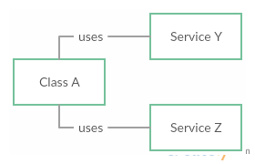

# Dependency Injection And Inversion Of Control

> Inversion of Control, or IoC, is an abstract principle describing an aspect of some software architecture designs in which the flow of control of a system is inverted in comparison to procedural programming.

To understand the explanation above, it is important to address what is procedural programming.

In procedural programming, a chunk of code that uses, or consumes, another chunk of code is in control of the process. This chunk of code knows exactly what piece of code, what method in what class, it uses.

The image above illustrates the procedural programming well. Class A, the consumer, needs the consumed classes (Services Y and Z), to run. Therefore, Class A instantiates both Y and Z classes before using those services.

The approach presented above induces a tight coupling and high dependency of Class A in relation to Classes Y and Z.
 
## Problem

* **Thigh Coupling. ** The group of classes are highly dependent on one another.

## Solution

## Consequence