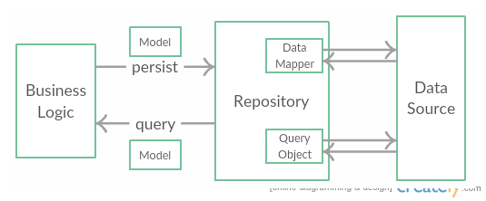

# Repository

The Repository Design Pattern is widely used in applications that work with any kind of persistence (e.g. a database). It is a part of Domain-Driven Design

It intends to create an abstraction for manipulating data present in the persistence of the application. It implements a collection of basic and commonly used Create, Read, Update and Delete (CRUD) operations. It also guarantees consistency across the application's access to persistence.

## Problem

* **High potential of programming errors.** Code is duplicate across the source code, breaking the Don't Repeat Yourself (DRY) principle.
* **Tight coupling.** Classes that access database become tightly coupled to database operations.
* **Lack of abstraction.** Without a repository, CRUD operations are not generic and very specific towards each table in the database.
* **Low testability.** CRUD operations are hard to be tested in isolation. Business logic is also hard to be tested in isolation due to its dependency.
* **Lack of consistency.** A change in the database schema implies a change in all classes that access that database to execute CRUD operations.
* **Non-centralized data-related policies.** Caching data becomes hard due to the lack of isolation.

## Solution

Using a repository to separate the database CRUD operations and map the results of these operations to an object (called Model in this case).

The image above represents the general idea of a repository:

Whenever a Business Logic needs to perform a query, it calls a method from the Repository. This method builds a Query Object (such as a SQL statement) and invokes the Data Source to execute the desired operation. Once the operation is executed, a response is sent back to the Repository by the Data Source. The Data Mapper translates this response into a Model and sends the response back to the Business Logic.

If the Business Logic requires a user to be fetched:

1. Code calls the Repository's method FindById with the id of the desired user (desired_id) as argument.
2. Repository builds a Query Object, such as *SELECT * FROM Users WHERE Id=:desired_id*, and sends it to the Data Source, in this case a Database.
3. If found, Data Source fetches the user and sends a response containing the User's info.
4. Data Mapper receives this data and automatically maps it into a Model.
5. Repository sends the Model back to the method that required the user.

If the Business Logic requires this user to be deleted:

1. Code call the Repository's method Delete with the user Model as argument.
2. Data Mapper maps the user Model into a Query Object.
3. Query is executed in Data Source, response is sent to repository, then to the method that required the user to be deleted.

## Consequence

* **Operations on data are centralized.** Repositories centralize all CRUD operations, guaranteeing maintainability, readability and consistency.
* **Increased testability.** Isolation promotes better unit testing.
* **Caching strategy.** Data can be easily cached and managed.
* ****

