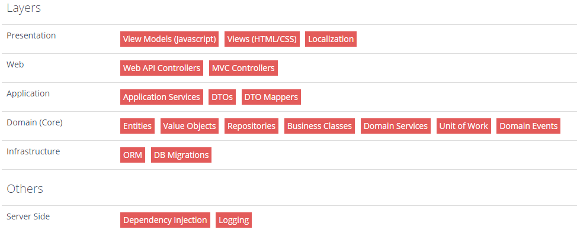

# ASP.NET Boilerplate's Architecture

Halil İbrahim Kalkan, author of the [ASP.NET Boilerplate](http://aspnetboilerplate.com/) (ABP) framework, suggests some changes to the default ASP.NET MVC framework, adding some extra layers to it, but also modifying the purpose of the existing ones.

What Kalkan suggests is to expand these layers into a few others, breaking the multipurpose controllers, implementing extra services and creating interfaces:

* **Presentation.** Provides an interface to the user. This is compared to the View layer, although from Kalkan's perspective, the presentation could be aimed to web, using HTML, CSS and JS, or any other option, such as Mobile applications.
* **Application.** Mediates between the Presentation and Domain Layers. It is compared to a controller, but lacks the core business logic.
* **Domain.** Also know as Core, includes the business objects of the application and its rules.
* **Infrastructure.** Provides generic technical capabilities that support higher layers, such as repositories to work with database.

From Kalkan's perspective, if a application requires a switch from Entity Framework to N-Hibernate, only the infrastructure would be affected, since this change is transparent to other layers. Or, if it requires an application to be segmented into multiple distinct platforms (such as mobile apps and a web portal), it is just a matter of implementing the Presentation layer in platform-specific ways, having the Application layer shared among them, accessed through an API.

The image above represents Hikalkan's point of view on ABP's N-Layer implementation.

## Presentation Layer

* **Views.** The presentation itself, built using HTML, CSS and JavaScript.
* **View Models.** Used in Single-Page Applications, such as Angular.
* **Localization.** Localization service should be available for the views, implementing internationalization (I18n) of the application.

## Web Layer

* **Web API Controllers.** A dynamic API giving access to Application Services, making the whole application accessible through an API that could be used, for example, to build a mobile app.
* **MVC Controllers.** These are the controllers from the MVC's Controller layer. It should be used only to manipulate data to/from the Views (Presentation layer). Unlike the MVC's controllers, it doens't contain business logic.

It is important to understand that the Presentation and Web layers may be unified as a single one, to simplify the implementation. The representation is divided to demonstrate that the Presentation layer is responsible for strictly front-end development and the Web layer is responsible for back-end code written in C#. From now on Presentation layer must be understood as a conjunction of Presentation and Web layers.

## Application Layer

* **Application Services.** Used to expose business logic to the Presentation layer. The communication between these layers occurs through Data Transfer Objects (DTOs). It may also contains specific business logic.
* **Data Transfer Objects (DTOs).** Used to transfer data between Application and Presentation layers. It is purely used to encapsulate data and diminish expensive remote calls between layers. It also provides loose coupling between layers, providing a way to mutate how the data is stored or processed without changing the way it is read from the Presentation layer's perspective. Only the way the data is mapped as a DTO must be modified.
* **DTO Mappers.** Mappers that map data into DTOs, preventing direct access to the data objects (entities) and increasing abstraction.

## Domain (or Core) Layer

* **Entities.** Classes that used to manipulate data in the database. A entity is mapped to a table from the database. It is a common concept from ORMs.
* **Value Objects.** Representation of objects that are equal independent of their identities.
* **Repositories.** Used to perform database operations, such as CRUD (Create, Read, Update, Delete). Therefore, the Application layer doesn't have to operate directly on the entities. Instead, it uses repositories that manipulate the data.
* **Business Classes.**
* **Domain Services.** Used to perform domain operations and business rules. Compared to repositories, they implement operations that are not natural (CRUD) for an entity. Domain services have extra logic implemented and use repositories for the basic operations. They are called managers in ABP.
* **Unit of Work.** Used to guarantee Atomicity, Consistency, Isolation and Durability (ACID) on database transactions. If a Unit of Work is declared and a transaction fails, the changes in the database are rolled back to the initial state.
* **Domain Events.** A sigleton object shared between classes, to register, trigger and notify events between classes.

## Infrastructure

* **ORM.** Object-Relational Mapping. The supported ones are Entity-Framework and NHibernate. It maps database operations and tables into object-oriented C#.
* **DB Migrations.** Management of incremental and reversal changes of database schema.

## Server Side

* **Dependency Injection.** Injects dependencies into classes, increasing testability and guaranteeing loose coupling between classes.
* **Logging.** Logging actions performed by users in the system.

