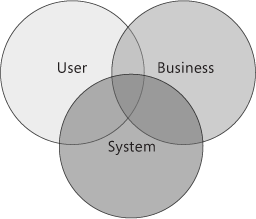

# What Is Software Architecture
> Software application architecture is the process of defining a structured solution that meets all of the technical and operational requirements, while optimizing common quality attributes such as performance, security, and manageability. It involves a series of decisions based on a wide range of factors, and each of these decisions can have considerable impact on the quality, performance, maintainability, and overall success of the application.
> -- <cite>Microsoft Application Architecture Guide, 2nd Edition</cite>

Whenever building a software, important decisions must be taken in order to achieve the great goal: success. Between these decisions, the important ones are:

* **Quality attributes.** Selecting non-functional requirements to evaluate the performance of the system .
* **Environment.** Choosing the right infrastructure, regarding software, hardware, network and services. The environment must satisfy the requirements of the desired system.
* **Design.** Description of the elements of a system. Defining how these elements fit together and  interact with each other.
*  **Human interaction.** How humans fit inside the system, whether they are stakeholders, developers or users.
*  **Business strategy.** Defining strategies that allow the organization to achieve its long-term objectives.

  
 
It is part of software architecture defining a architecture that will satisfy user, business and system goals. It is a hard balance to achieve.

## The Importance of Software Architecture
In short, it is all about building an application on top of a solid foundation. Planning and making great decisions during the early stages of the development process avoid risks and bad consequences in the long term. 
## Goals of Software Architecture

It is important to address the main goals of software architecture:

* **Expose the structure of the system.** Avoid implementation details.
* **Address requirements of stakeholders.**
* **Address all use-case scenarios.**
* **Handle functional and quality requirements.**
* **Be flexible.** Being able to easily handle the recurring mutability of the software.

## Key Architecture Principles

Some key principles must be kept in mind when designing an architecture:

* **Focus on change instead of durability.** Applications constantly change with time. Building a flexible application is crucial.
* **Model to analyze and reduce risks.** Modeling the architecture using tools like the Unified Modeling Language (UML) helps the visualization of the system, facilitating the understanding of the system as a whole. Being prepared for the risks that may arise is also important to avoid problems.
* **Communication.** Stakeholders must be easily aware of the architecture.
* **Identify great engineering decisions.** Knowing to identify and avoid the most common mistakes.
* **Recursive and incremental strategy.** Building cycles of development focused on creating, modifying and refactoring features or components.

## Key Design Principles

When building an architecture, some choices regarding the design of the architecture must be made. It is about taking decisions aiming to minimize costs and maintenance requirements, and also promoting usability and extendibility. These principles are:

* **Separation of concerns.** Dividing the application into multiple, distinct areas with features with as little overlap in functionality as possible. This makes it easier to design and build the application, as well as allowing developers in multiple disciplines (database, server-side, front-end, design) to work in parallel.
* **Single Responsibility principle.** Each component or module should be responsible for only a specific feature or functionality, or aggregation of cohesive functionality.
* **Principle of Least Knowledge.** Also known as the Law of Demeter. A component or object should not know about internal details of other components or objects.
* **Don't Repeat Yourself (DRY).** Functionalities should not have duplicates.
* **Minimize upfront design.** Avoiding Big Design Upfront (BDUF). It is about designing only what is necessary and improving it later when needed.
* **Abstraction.** Each component or module has its own responsibility, which can be analyzed in isolation and transparently to other components or modules.
* **Testability.** The ability of testing each component or module separately, since there are fewer dependencies between components or modules.
* **Replaceability.** Being able to replace a component or module without afecting others directly.
* **Reuse.** Being capable of reusing a component or module in other applications.

These principles are about being consistent, separating concerns, decreasing costs, establishing code styles aiming uniformity and being abstract.

## Objectives